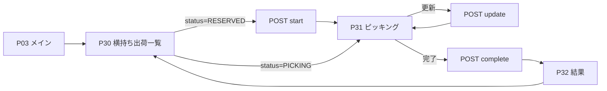

# 横持ち出荷 Android 実装設計書

- 作成日: 2026-04-19
- 対象: `sakemaru-handy-android`
- 前提 API: `prompts/20260418/proxy-shipment-api-specification.md`

## 1. 目的

横持ち出荷 API を Android ハンディアプリから扱えるようにし、通常出荷の UX と統一感を保ちながら、次の業務を成立させる。

1. 横持ち出荷一覧の取得
2. allocation 単位のピッキング開始
3. 数量途中保存
4. ピッキング完了
5. 完了結果と `stock_transfer_queue_id` の確認

## 2. 採用方針

### 2.1 画面の置き場所

Phase 1 は P03 メイン画面の「移動処理」スロットを横持ち出荷の入口として使う。

推奨:

- 表示ラベルを `横持ち出荷` に変更する
- ルートは新規で `proxy_shipment_*` を追加する

理由:

1. 既存メニューに未使用スロットがある
2. 横持ち出荷完了後に `stock_transfer_queue` を作るため、業務上は移動処理に近い
3. 通常出荷 P20〜P22 に混ぜるより責務分離が明確

### 2.2 画面番号とルート

| 画面 | 役割 | ルート |
| --- | --- | --- |
| P30 | 横持ち出荷一覧 | `proxy_shipment_list` |
| P31 | 横持ち出荷ピッキング | `proxy_shipment_picking/{allocationId}` |
| P32 | 横持ち出荷結果 | `proxy_shipment_result/{allocationId}` |

## 3. 画面フロー



## 4. パッケージ / ファイル構成

新規モジュールは作らず、`:feature:outbound` 配下へ追加する。

### 4.1 UI 層

```text
feature/outbound/src/main/java/.../proxyshipment/list/
  ProxyShipmentListScreen.kt
  ProxyShipmentListViewModel.kt
  ProxyShipmentListState.kt

feature/outbound/src/main/java/.../proxyshipment/picking/
  ProxyShipmentPickingScreen.kt
  ProxyShipmentPickingViewModel.kt
  ProxyShipmentPickingState.kt

feature/outbound/src/main/java/.../proxyshipment/result/
  ProxyShipmentResultScreen.kt
  ProxyShipmentResultViewModel.kt
  ProxyShipmentResultState.kt
```

### 4.2 ドメイン / 通信層

```text
core/domain/src/main/java/.../model/
  ProxyShipmentSummary.kt
  ProxyShipmentDetail.kt
  ProxyShipmentCompletionResult.kt
  ProxyShipmentStatus.kt
  ProxyShipmentQuantityType.kt

core/domain/src/main/java/.../repository/
  ProxyShipmentRepository.kt

core/network/src/main/java/.../api/
  ProxyShipmentApi.kt

core/network/src/main/java/.../model/
  ProxyShipmentModels.kt

core/network/src/main/java/.../repository/
  ProxyShipmentRepositoryImpl.kt
```

### 4.3 ナビゲーション / DI 変更

変更対象:

- `Routes.kt`
- `HandyNavHost.kt`
- `MainScreen.kt`
- `NetworkModule.kt`

## 5. データモデル設計

### 5.1 Summary

一覧と Repository 共有状態の基礎になるモデル。

```kotlin
data class ProxyShipmentSummary(
    val allocationId: Int,
    val shortageId: Int,
    val shipmentDate: String,
    val status: ProxyShipmentStatus,
    val pickupWarehouse: WarehouseRef,
    val destinationWarehouse: WarehouseRef,
    val deliveryCourse: DeliveryCourseRef?,
    val item: ProxyShipmentItem,
    val assignQty: Int,
    val assignQtyType: ProxyShipmentQuantityType,
    val pickedQty: Int,
    val remainingQty: Int,
    val customer: CustomerRef?,
    val slipNumber: Int?,
    val isEditable: Boolean
)
```

### 5.2 Detail

詳細画面専用情報を追加したモデル。

```kotlin
data class ProxyShipmentDetail(
    val summary: ProxyShipmentSummary,
    val shortageDetail: ShortageDetail,
    val candidateLocations: List<CandidateLocation>
)
```

### 5.3 Completion Result

結果画面で表示する最終スナップショット。

```kotlin
data class ProxyShipmentCompletionResult(
    val allocationId: Int,
    val status: ProxyShipmentStatus,
    val pickedQty: Int,
    val isEditable: Boolean,
    val stockTransferQueueId: Int?
)
```

### 5.4 JAN の扱い

通常出荷の `janCode: String?` では不足するため、横持ち出荷では `janCodes: List<String>` をモデルに持つ。

理由:

1. API が `jan_codes[]` を返す
2. スキャナ一致判定は代表 JAN ではなく全 JAN で見るべき

## 6. Repository 設計

### 6.1 方針

通常出荷の `tasksFlow` パターンは維持しつつ、横持ち出荷専用に `allocationsFlow` を持つ。

### 6.2 Interface

```kotlin
interface ProxyShipmentRepository {
    val allocationsFlow: StateFlow<List<ProxyShipmentSummary>>
    fun allocationFlow(allocationId: Int): Flow<ProxyShipmentDetail?>
    fun completionFlow(allocationId: Int): Flow<ProxyShipmentCompletionResult?>

    suspend fun getAllocations(
        warehouseId: Int,
        shipmentDate: String?,
        deliveryCourseId: Int?
    ): Result<List<ProxyShipmentSummary>>

    suspend fun getAllocationDetail(
        allocationId: Int,
        warehouseId: Int
    ): Result<ProxyShipmentDetail>

    suspend fun startAllocation(
        allocationId: Int,
        warehouseId: Int
    ): Result<ProxyShipmentSummary>

    suspend fun updatePickedQty(
        allocationId: Int,
        warehouseId: Int,
        pickedQty: Int
    ): Result<ProxyShipmentDetail>

    suspend fun completeAllocation(
        allocationId: Int,
        warehouseId: Int,
        pickedQty: Int?
    ): Result<ProxyShipmentCompletionResult>
}
```

### 6.3 Repository の振る舞い

1. 一覧取得で `allocationsFlow` を置き換える
2. 詳細取得で detail cache を更新する
3. `start` 成功時は該当 allocation の status を `PICKING` に更新する
4. `update` 成功時は一覧と detail cache の `pickedQty`, `remainingQty`, `status` を更新する
5. `complete` 成功時は completion cache を保存し、`allocationsFlow` から該当 allocation を除外する

## 7. 状態設計

### 7.1 一覧画面 State

```kotlin
data class ProxyShipmentListState(
    val isLoading: Boolean = false,
    val isRefreshing: Boolean = false,
    val errorMessage: String? = null,
    val warehouseName: String = "",
    val shipmentDate: String = "",
    val availableCourses: List<DeliveryCourseFilter> = emptyList(),
    val selectedCourseId: Int? = null,
    val selectedStatusTab: ProxyShipmentListTab = ProxyShipmentListTab.RESERVED,
    val allocations: List<ProxyShipmentSummary> = emptyList()
)
```

タブは 2 つに限定する。

- `RESERVED` = 未着手
- `PICKING` = ピッキング中

完了済みは一覧 API 対象外のためタブを作らない。

### 7.2 ピッキング画面 State

```kotlin
data class ProxyShipmentPickingState(
    val isLoading: Boolean = false,
    val isStarting: Boolean = false,
    val isUpdating: Boolean = false,
    val isCompleting: Boolean = false,
    val errorMessage: String? = null,
    val detail: ProxyShipmentDetail? = null,
    val pickedQtyInput: String = "",
    val quantityErrorMessage: String? = null,
    val showImageDialog: Boolean = false,
    val showJanScannerDialog: Boolean = false,
    val janScanResult: JanScanResult? = null,
    val hasUnsavedChanges: Boolean = false
)
```

### 7.3 結果画面 State

```kotlin
data class ProxyShipmentResultState(
    val completion: ProxyShipmentCompletionResult? = null,
    val summary: ProxyShipmentSummary? = null
)
```

## 8. 画面仕様

### 8.1 P30 横持ち出荷一覧

#### 表示要素

1. 現在倉庫
2. 日付フィルタ
3. 配送コースフィルタ
4. ステータスタブ（未着手 / ピッキング中）
5. allocation カード一覧

#### カード表示項目

1. 配送コース名
2. 得意先名
3. 商品コード / 商品名
4. 出荷元倉庫 -> 送り先倉庫
5. `pickedQty / assignQty` と数量単位
6. ステータスバッジ

#### 動作

1. 初回表示時は `warehouse_id` のみで取得し、`meta.business_date` を受け取って画面ローカルの初期日付に採用する
2. 日付変更時は `shipment_date` を付けて再取得する
3. コース変更時は `delivery_course_id` を付けて再取得する
4. カードタップ時:
   - `status == RESERVED` なら `POST start` 後に P31 へ
   - `status == PICKING` ならそのまま P31 へ

### 8.2 P31 横持ち出荷ピッキング

#### 表示要素

1. 商品名 / 商品コード / 容量 / 温度帯
2. JAN 一覧
3. 画像ボタン
4. 出荷元倉庫 / 送り先倉庫 / 配送コース / 得意先
5. 指示数 / 実績数 / 残数
6. 数量入力 1 フィールド
7. 欠品情報 (`shortage_detail`)
8. 候補ロケーション一覧
9. ボタン:
   - `更新`
   - `完了`
   - `一覧へ戻る`

#### UI 上の差分

通常出荷 P21 と違って、以下は出さない。

1. 得意先別入力テーブル
2. CASE / PIECE の複数行配分
3. 履歴遷移ボタン
4. 前へ / 次への商品ページャー

#### 入力仕様

1. 入力は整数のみ
2. `0 <= pickedQty <= assignQty`
3. 単位ラベルは `assign_qty_type` をそのまま表示する
4. `CARTON` も UI で表示可能にする

#### JAN スキャン

1. `item.janCodes` のいずれかに一致したら成功
2. 一致結果は成功 / 不一致を画面で表示
3. `janCodes` が空ならスキャンボタンを disabled にする

#### 更新 / 完了の流れ

1. 画面表示時は必ず `GET /proxy-shipments/{id}` を呼ぶ
2. `更新` は `POST /update`
3. `完了` は `POST /complete`
4. `complete` 成功後は P32 に遷移する

#### 戻る時の扱い

`pickedQtyInput` がサーバ値と異なる場合は確認ダイアログを出す。

- 破棄して戻る
- 更新して戻る
- キャンセル

### 8.3 P32 横持ち出荷結果

#### 表示要素

1. 完了メッセージ
2. 完了ステータス
3. 実績数
4. `stock_transfer_queue_id`
5. 「一覧へ戻る」ボタン

#### 表示ルール

| 条件 | 表示 |
| --- | --- |
| `status == FULFILLED` | 完了 |
| `status == SHORTAGE` | 欠品あり完了 |
| `stockTransferQueueId != null` | 移動伝票キュー ID を表示 |
| `stockTransferQueueId == null` | 「移動伝票は作成されていません」を表示 |

## 9. API マッピング

| 画面操作 | API | 備考 |
| --- | --- | --- |
| 一覧初回表示 | `GET /api/proxy-shipments` | 初回は `warehouse_id` のみでも可。`meta.business_date` を採用 |
| 一覧の絞り込み | `GET /api/proxy-shipments` | `shipment_date`, `delivery_course_id` を追加 |
| カード選択（未着手） | `POST /api/proxy-shipments/{id}/start` | 成功後に P31 遷移 |
| カード選択後の表示 | `GET /api/proxy-shipments/{id}` | `candidate_locations`, `shortage_detail` を取得 |
| 数量途中保存 | `POST /api/proxy-shipments/{id}/update` | `warehouse_id`, `picked_qty` |
| 完了 | `POST /api/proxy-shipments/{id}/complete` | `warehouse_id`, `picked_qty?` |

## 10. ナビゲーション設計

### 10.1 Route 定義

```kotlin
object ProxyShipmentList : Routes("proxy_shipment_list")
object ProxyShipmentPicking : Routes("proxy_shipment_picking/{allocationId}") {
    fun createRoute(allocationId: Int) = "proxy_shipment_picking/$allocationId"
}
object ProxyShipmentResult : Routes("proxy_shipment_result/{allocationId}") {
    fun createRoute(allocationId: Int) = "proxy_shipment_result/$allocationId"
}
```

### 10.2 Shared ViewModel 方針

通常出荷の `selectedTask` パターンは採用しない。

理由:

1. 横持ち出荷は詳細 API を毎回叩く必要がある
2. `allocationId` だけで画面再構築できる方が回復性が高い
3. 結果画面は completion cache を見ればよい

## 11. 日付設計

### 11.1 採用方針

横持ち出荷は `TokenManager.getShippingDate()` を一次ソースにしない。

理由:

1. 現在値は `yyyy/MM/dd`
2. 横持ち出荷 API は `yyyy-MM-dd`
3. 最新仕様では `meta.business_date` が基準

### 11.2 実装ルール

1. 一覧 ViewModel が API 用日付を自前管理する
2. 表示用は `yyyy/MM/dd`、API 送信用は `yyyy-MM-dd` に変換する
3. 変換は専用 utility に閉じる

```kotlin
object ProxyShipmentDateFormatter {
    fun toDisplay(apiDate: String): String
    fun toApi(displayDate: String): String?
}
```

## 12. エラー処理

| ケース | 画面動作 |
| --- | --- |
| 404 | 「対象データが見つかりません」を表示し一覧再読込 |
| 422 | API の `error_message` をそのまま Snackbar 表示 |
| update 失敗 | 入力は保持し、再試行可能にする |
| complete 失敗 | べき等なので同じリクエストを再試行可能と案内する |
| 通信断 | Refresh / Retry を表示 |

補足:

- `complete` は再送安全なので、タイムアウト時の UX は「失敗扱いで終了」ではなく「再試行」を基本にする。

## 13. 実装ステップ

1. `core/domain`, `core/network` に ProxyShipment の model / repository / api を追加
2. `Routes.kt`, `HandyNavHost.kt`, `MainScreen.kt` に新ルートと入口を追加
3. P30 一覧画面とフィルタを実装
4. P31 詳細 / 更新 / 完了画面を実装
5. P32 結果画面を実装
6. `prompts/pages.md` を P30-P32 の実装済み仕様で更新
7. `curl` またはテストコードで start / update / complete の実 API 動作を確認

## 14. 検証項目

### 14.1 ハネス適合

1. Portrait / Landscape の両方でレイアウトが崩れない
2. `ViewModel + StateFlow` を守る
3. `NetworkException` を UI メッセージに正規化できる
4. 各 Screen に Preview を用意する

### 14.2 業務検証

1. `RESERVED` の一覧表示
2. `PICKING` の再入場
3. `picked_qty > assign_qty` の 422 表示
4. `complete` 再送時の重複作成なし
5. `picked_qty = 0` 完了時の queue 未作成表示

## 15. 残課題

1. P03 の「移動処理」ラベルを `横持ち出荷` に変えるか、そのままにするかは業務用語の最終確認が必要
2. API 初回取得で `shipment_date` 省略時にサーバが `meta.business_date` 基準で返す前提かどうかは、実装前に確認したい
3. `JanCodeScannerDialog` が単一 JAN 前提なら、`List<String>` 対応に拡張が必要
